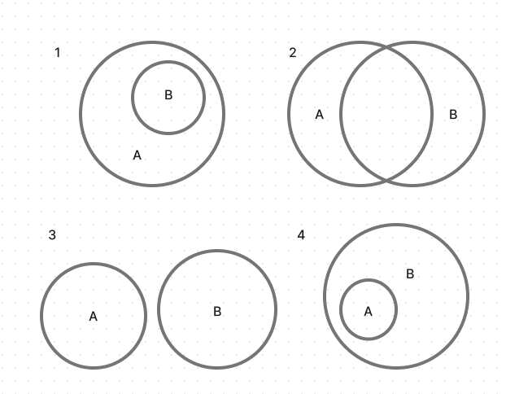

### Дрекалов Никита, 5030102/20001, дз на 14.02.2024
## Онтология наивной теории множеств 
- Элементами семейства являются множетсва, при этом семейства - частный случай множества
- Множетсва состоят из элементов (элементы - это объекты, из которых составлено множество) и множество может сама быть элементом другого множества   
(Парадокс Расселла - парадокс принажлежности множества самому себе)
- Множества бывают конечными и бесконечными
    - Примерами конечных множеств можно считать алфавит и пустое множество
        - Алфавит состоит из букв
    - Бесконечные множества бывают счетными и несчетными
- Множетсва и последовательности являются чатсным случаем мультимножеств
- Последовательность имеет свойство упорядоченности
    - Примером последовательности является слово, которое состоит из букв, причём из слов формируется язык 

## Записать решение уравнения $A \cup X = B$

1. $ B \subset A $ $ \wedge $ $ B != A $ \
$ A \subset A \cup X =  B $, то есть $ A \subset B $ $ \wedge $ $ B \subset A $, то есть $ A = B $, что противоречит условию. Решений нет

2. $ A \cap B != \oslash $ $ \wedge $ $ B \setminus A != \oslash $ $ \wedge $ $ A \setminus B != \oslash $ \
$ A \subset A \cup X =  B $, то есть $ A \subset B $, что значит, что $ B \setminus A = \oslash $, что противоречит условию. Решений нет

3. $ A \cap B = \oslash $ \
$ A \subset A \cup X =  B $, то есть $ A \cap B != \oslash $, что противоречит условию. Решений нет

4. $ A \subset B $
$B = A \cup B \setminus A $ \
подставим B в уравнение, получим $ A \cup X = A \cup B \setminus A $ \
отсюда очевидно, что $ X = B \setminus A $ \
(сюда же подходит случий $ A = B $)

**Ответ:** решение есть только в случае, когда $ A \subset B $ и оно равно $ X = B \setminus A $

## Записать решение уравнения $A \bigtriangleup X = B$

Применим операцию $A \bigtriangleup .$ слева к обоим частям равенства. Тогда получим \
$A \bigtriangleup A \bigtriangleup X = A \bigtriangleup B$

так как $A \bigtriangleup A = \oslash$, выхлжит, что \
$X = A \bigtriangleup B$ \
**Ответ:** $ X = A \bigtriangleup B $
